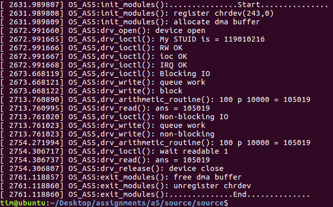

# File Operations in Kernel Space

In this project, the main job is to make a prime device in Linux, and implement file operations in kernel module to control this device.

## Routine Design

### 1.1	drv_read()
In this routine, we simply use the function myini() to fetch the computed answer from the corresponding address in the DMA buffer and then transmit the data to user program via put_user(). Afterwards, we first clear the result in the buffer by setting its value to zero and update related flags in the DMA buffer in including that for read completion and mark the data to be unreadable by any other user program attempting to retrieve the data. 
### 1.2 drv_write()
In the perspective of user program, data is transmitted into the device in the kernel memory space through the invocation of write() which maps to drv_write() in the kernel mode. This routine first transfers data obtained from the user program into the direct memory access (DMA) buffer for future use. The function get_user() can help to realize the functionality when dealing with variables of primitive types such char, int, short, and etc. However, the data transferred into the DMA buffer is a user-defined structure which is a complex variable and we can not use get_user() directly. What we are going to do is transfer the data one by one. After declaring the structure DataIn in the routine, we use get_user() to transfer the type-casted data into the corresponding parameters in the already declared DataIn structure. For instance, the first parameter a can be accessed by buffer, the second parameter b can be accessed by buffer+1, and the last by buffer+2. Upon the completion of the step, we are now ready to transfer the obtained data into the DMA buffer via myoutx() where x can be c, s, or i in different circumstances. Up to now, we can schedule the work based on the I/O mode (blocking or non-blocking). If the process is in blocking mode, the user program will have to wait until the computation has finished, while in non-blocking mode, the process will return immediately with the computation still on-going.
### 1.3	drv_ioctl()
In this function, we will perform a specific operation based on the passed-in command and data. Like what we have done in section 1.2, we use get_user() to transfer the argument provided by the user program into the kernel space. According to different command, we configure the setting of the device mostly by storing the data into the corresponding location in the DMA buffer and print out the message. For instance, if the command is HW5_IOCSETSTUID, we first use myouti() to store the student ID in the address DMASTUIDADDR and then, print out the message in the kernel space. One special command which requires careful consideration is HW5_IOCWAITREADABLE. We use a while loop to check whether the answer is readable or not. If it is not readable, we sleep for 500 ms and check the status again until it is ready which is similar to busy-waiting polling.
### 1.4	drv_arithmetic_routine()
The implementation of this routine is fairly straightforward. We first use myinx() where x is c, i, or s in different situations to fetch the data stored in the DMA buffer and perform the arithmetic operations. Once completing the operation, we store the answer in the DMA buffer and set it to be readable so that the answer can be read in the non-blocking mode. 
### 1.5	init_modules() & exit_modules()
In the initialization step, we first allocate adequate amount space for a register device based on the operation structure, MAJOR and MINOR number obtained and make it alive. Then, we allocate DMA buffer in the kernel space to store data and flags. Last but not least, work routine has been allocated for scheduling and synchronization. In the exit step, we simply free the kernel space that has been allocated in the previous step and print out the ending messages.

## Sample Outputs
The following picture shows the reuslts in kernel space.

