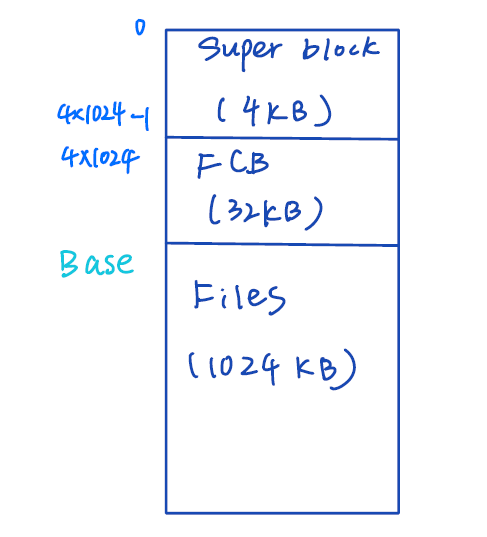
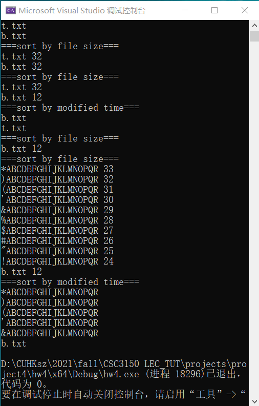

# File System Implementation

## Basics
In this project, we are going to design a simplified version of a file system. The volume in the file system basically consists of three parts—super block, file control blocks (FCB), and contents of the file.
The super block is where the free space manager locates and has 4 KB. Since the block size is 32 bytes and the maximum storage for files is 1024 KB, we can map exactly one bit from the super block to each the block that stores a file. In other words, if a series of bits in the super block equal to 0 (default value), the corresponding blocks to store contents should be empty. Otherwise, they have been occupied by some files. 
The information of all files such as size, modified time, and permission are stored in FCB. Hence, there are in sum 1024 entries in FCB with each entry of size 32 KB.

The following is an illustration.


## Execution
```
# compile
make
# clear
make clean
# run
./main.out
```

## Results
A sample result is shown as follows.


