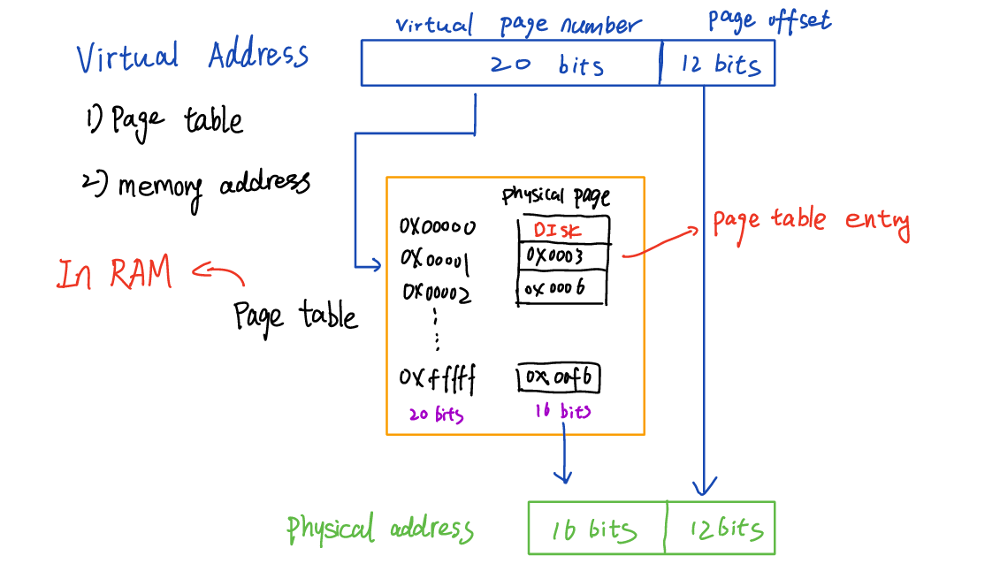

# Kernel module insertion

In this project, a simplified virtual memory was implemented. 

## Basics
Suppose that we are using a 32-bit (virtual address) machine with 256MB RAM and 4KB for each page. Then, there will be 12 bits in the virtual address used to indicate the page offset and the remaining 20 bits are for virtual page number. During the address translation, the page offset stays the same but we are going to find the corresponding physical page (frame) number via the page table. In this case, 16 bits are contributed to the physical page number. The following shows the fundamental components of a virtual memory.



Similarly, the page size in project 3 is 32 bytes, which means that we will use 5 bits in the virtual address to indicate that. Note that an inverted page table is constructed in this project, so the index of each entry is the same as the physical page number.

## How to run the program?
```
# compile
make
# clear
make clean
# execute
./main.out
```